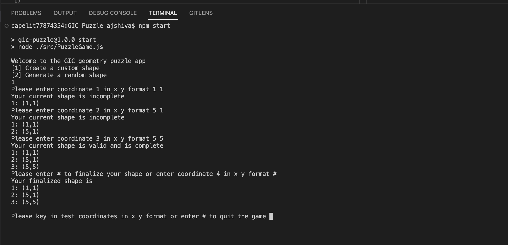
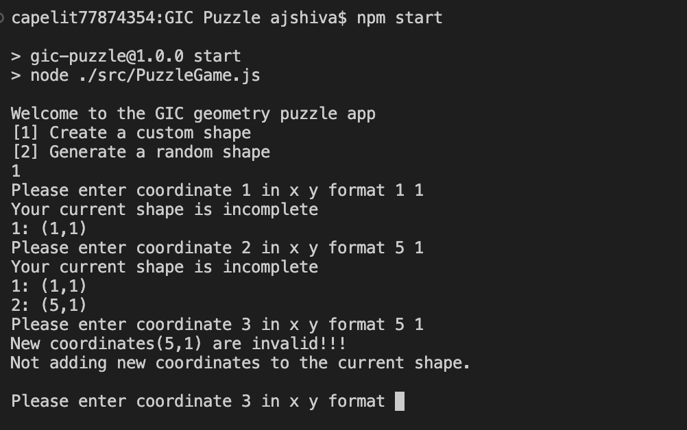
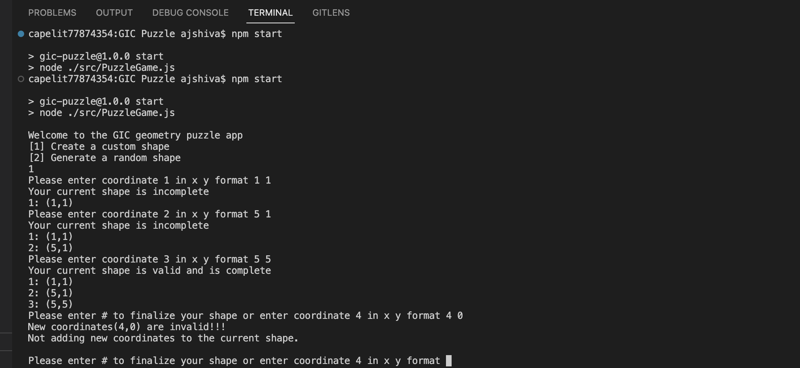
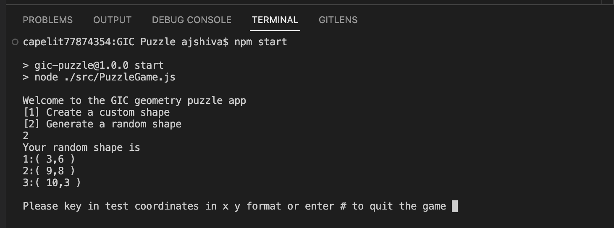
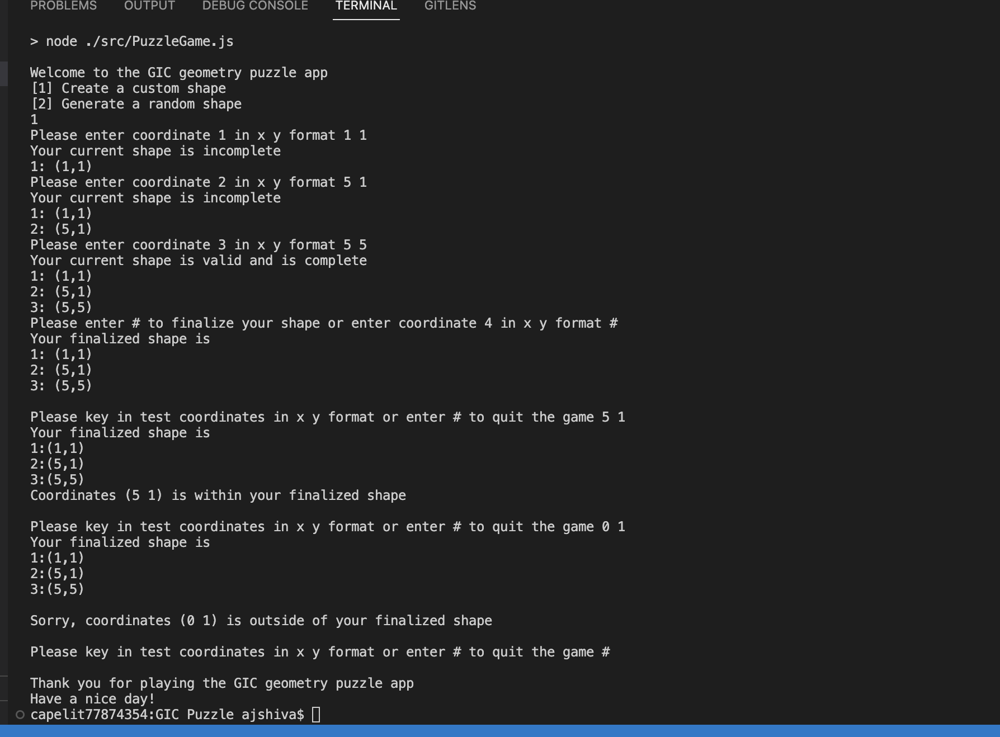

# Project Name

GIC Geometry puzzle game.

## Table of Contents

- [Installation](#installation)
- [TestUsage](#TestUsage)
- [Test Case](#TestCase)
- [Proof Usage](#screenshots)

## Installation

Step 1: `npm install`

## Test Case

`npm test`

## Usage

`npm start`

## screenshots
Note: To see images click on open preview to the slide on vs code.

### Create a custom shape

### Validate input coordinates
#### 1) Adding existing x and y coordinates.

#### 2) If any coordinates is Zero (0)

### Generate a random shape

### Puzzle Section

## Components
GeometryInputHandler: Manages user inputs through the console using Node.js's readline module. It wraps the readline interface to asynchronously ask questions and fetch responses from the user.

PointInPolygonChecker: Contains a static method pointInPolygon to determine if a given point is inside a specified polygon using the ray-casting algorithm. This method accounts for points on edges and vertices as being inside the polygon.

ShapeCreator: Provides functionalities to create random shapes or custom shapes based on user inputs. It leverages ShapeValidator to ensure the generated points meet specific criteria (non-zero, unique).

ShapeValidator: Validates user-provided coordinates and generates unique, non-zero coordinates. It's used to ensure the integrity of the shapes being created or manipulated within the game.

PuzzleGame: Orchestrates the game by utilizing the above components. It allows users to create custom or random shapes and then test if specific points are within these shapes. It provides a simple text-based interface for interaction.
